# babylon.quarks standalone

[](https://www.npmjs.com/package/babylon.quarks)
[](https://github.com/Soullnik/babylon.quarks-standalone/actions/workflows/ci.yml)
[](LICENSE)

Monorepo for the `babylon.quarks` npm package, an in-house visual effect editor, a Unity exporter and Babylon.js examples — a high-performance batched particle system for [Babylon.js](https://www.babylonjs.com/), built on the `quarks.core` engine (historically derived from [quarks.art](https://quarks.art/) / three.quarks).

## npm package

- Package: [`babylon.quarks`](https://www.npmjs.com/package/babylon.quarks)
- Install:

```bash
npm install babylon.quarks @babylonjs/core
```

## Get started

Use the package in your Babylon.js app:

```ts
import {BatchedRenderer, ParticleSystem} from "babylon.quarks";
```

Then initialize `BatchedRenderer` with your Babylon scene and add one or more `ParticleSystem` instances.

For the Babylon.js Playground or plain `<script>` usage there is a UMD bundle exposed as the `BabylonQuarks` global — see the [package README](packages/babylon.quarks/README.md#use-in-the-babylonjs-playground) for a paste-ready Playground snippet:

```js
await BABYLON.Tools.LoadScriptAsync("https://cdn.jsdelivr.net/npm/babylon.quarks/dist/babylon.quarks.umd.min.js");
const {BatchedRenderer, ParticleSystem} = BabylonQuarks;
```

## Author effects

- **[Effect editor](https://soullnik.github.io/babylon.quarks-standalone/editor.html)** — our own Shuriken-style visual editor (hierarchy panel + module inspector). Try it live, or run it locally with `npm run examples` and open `editor.html`. See the [`babylon.quarks-editor` README](packages/babylon.quarks-editor/README.md) to embed it in your own app.
- **[Unity exporter](tools/unity-quarks-exporter/README.md)** — author in Unity's Shuriken Particle System and export straight to Quarks JSON via a Unity Editor tool (`.unitypackage`, UPM, or copy-in).
- Effects exported from the [quarks.art](https://quarks.art/) editor still load fine — it's the same JSON format, read by `QuarksLoader` regardless of which tool produced it.

## Live examples

[GitHub Pages demo](https://soullnik.github.io/babylon.quarks-standalone/) · [API docs](https://soullnik.github.io/babylon.quarks-standalone/docs/) · [Particle benchmark](https://soullnik.github.io/babylon.quarks-standalone/benchmark.html) (babylon.quarks vs Babylon's built-in CPU/GPU particle systems)

| | | | |
|---|---|---|---|
| [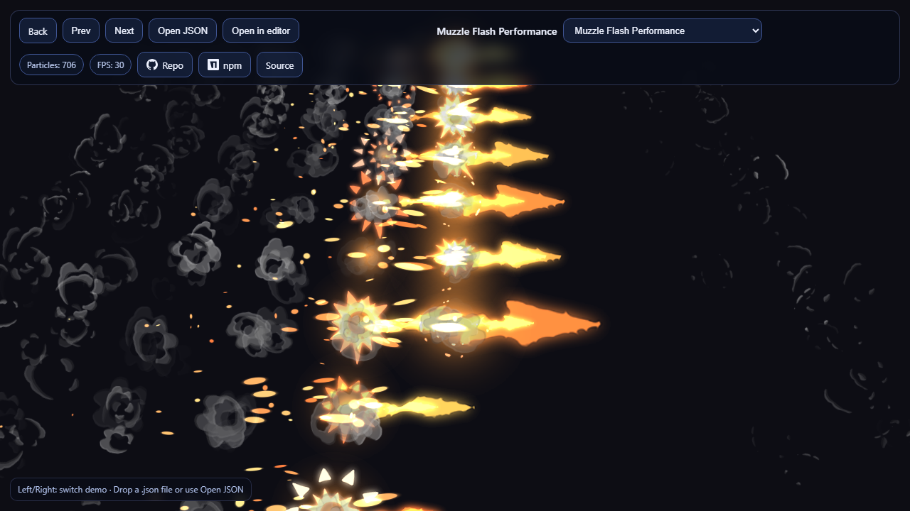](https://soullnik.github.io/babylon.quarks-standalone/babylonDemo.html#MuzzleFlashDemo)<br>[Muzzle Flash](https://soullnik.github.io/babylon.quarks-standalone/babylonDemo.html#MuzzleFlashDemo) | [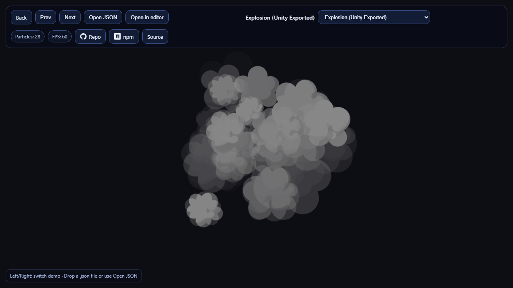](https://soullnik.github.io/babylon.quarks-standalone/babylonDemo.html#ExplosionDemo)<br>[Explosion (Unity export)](https://soullnik.github.io/babylon.quarks-standalone/babylonDemo.html#ExplosionDemo) | [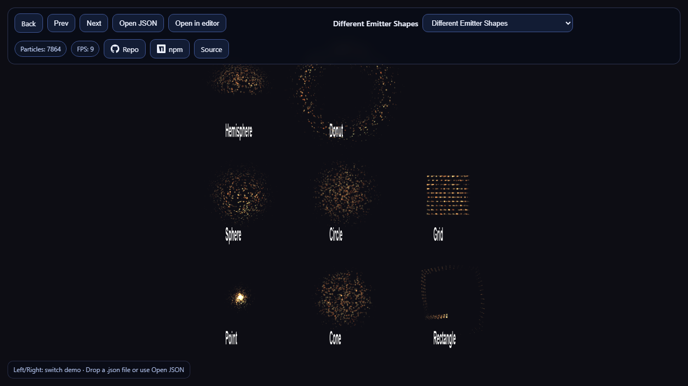](https://soullnik.github.io/babylon.quarks-standalone/babylonDemo.html#EmitterShapeDemo)<br>[Emitter Shapes](https://soullnik.github.io/babylon.quarks-standalone/babylonDemo.html#EmitterShapeDemo) | [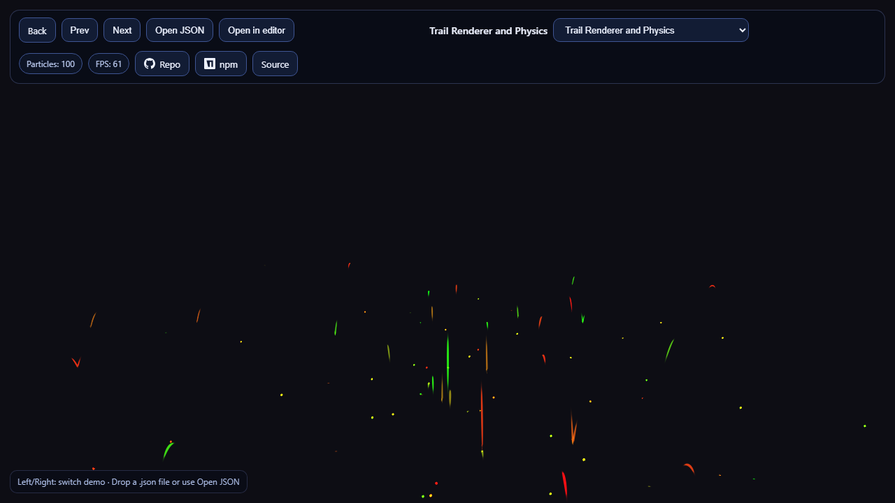](https://soullnik.github.io/babylon.quarks-standalone/babylonDemo.html#TrailDemo)<br>[Trail Renderer](https://soullnik.github.io/babylon.quarks-standalone/babylonDemo.html#TrailDemo) |
| [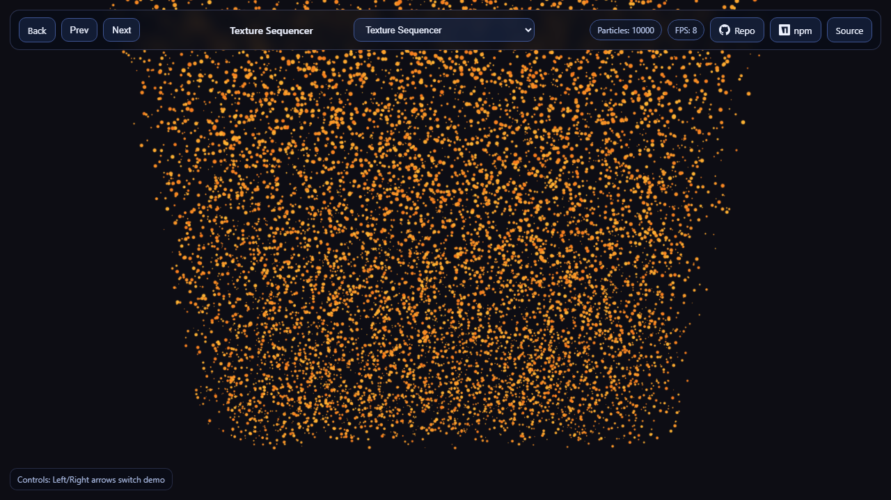](https://soullnik.github.io/babylon.quarks-standalone/babylonDemo.html#SequencerDemo)<br>[Texture Sequencer](https://soullnik.github.io/babylon.quarks-standalone/babylonDemo.html#SequencerDemo) | [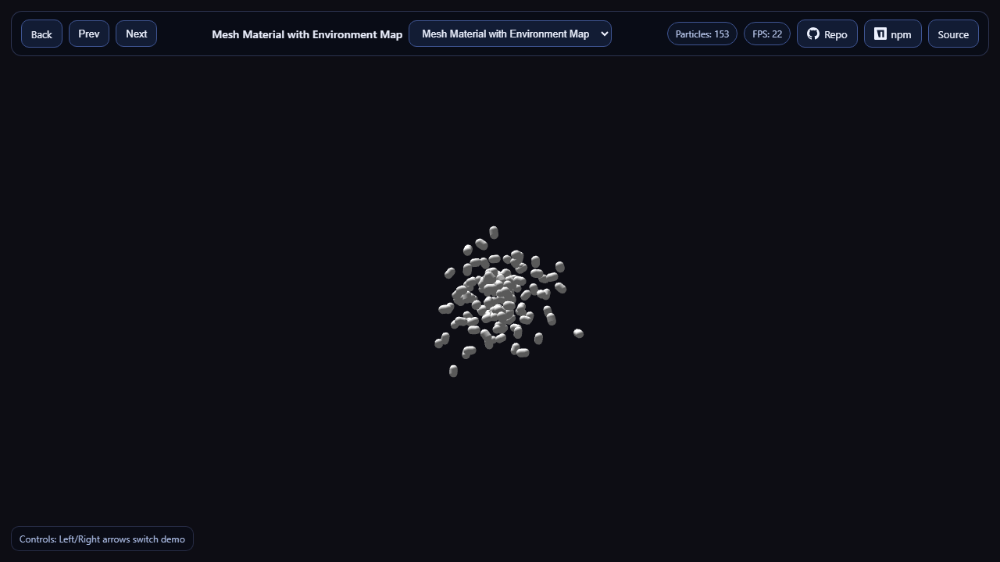](https://soullnik.github.io/babylon.quarks-standalone/babylonDemo.html#MeshMaterialDemo)<br>[Mesh Material](https://soullnik.github.io/babylon.quarks-standalone/babylonDemo.html#MeshMaterialDemo) | [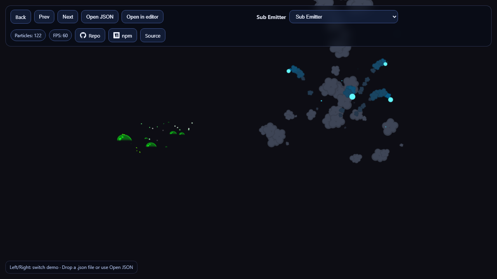](https://soullnik.github.io/babylon.quarks-standalone/babylonDemo.html#SubEmitterDemo)<br>[Sub Emitter](https://soullnik.github.io/babylon.quarks-standalone/babylonDemo.html#SubEmitterDemo) | [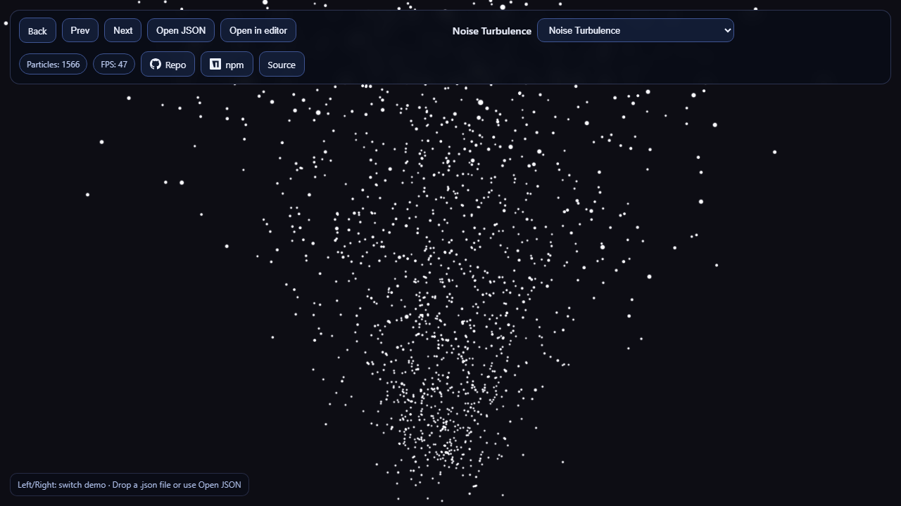](https://soullnik.github.io/babylon.quarks-standalone/babylonDemo.html#TurbulenceDemo)<br>[Noise Turbulence](https://soullnik.github.io/babylon.quarks-standalone/babylonDemo.html#TurbulenceDemo) |
| [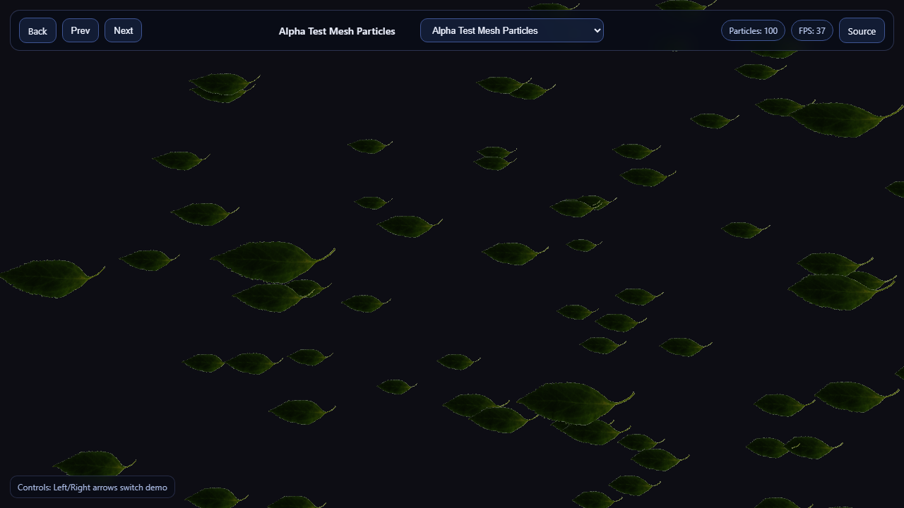](https://soullnik.github.io/babylon.quarks-standalone/babylonDemo.html#AlphaTestDemo)<br>[Alpha Test Mesh](https://soullnik.github.io/babylon.quarks-standalone/babylonDemo.html#AlphaTestDemo) | [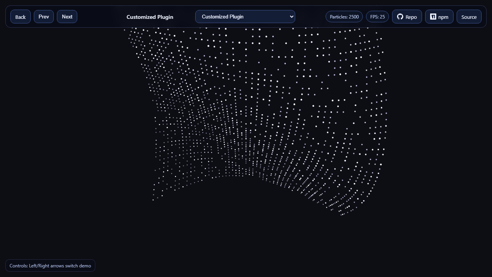](https://soullnik.github.io/babylon.quarks-standalone/babylonDemo.html#CustomPluginDemo)<br>[Custom Plugin](https://soullnik.github.io/babylon.quarks-standalone/babylonDemo.html#CustomPluginDemo) | [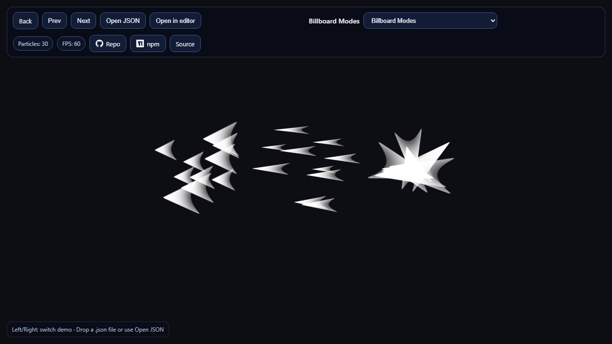](https://soullnik.github.io/babylon.quarks-standalone/babylonDemo.html#BillboardDemo)<br>[Billboard Modes](https://soullnik.github.io/babylon.quarks-standalone/babylonDemo.html#BillboardDemo) | [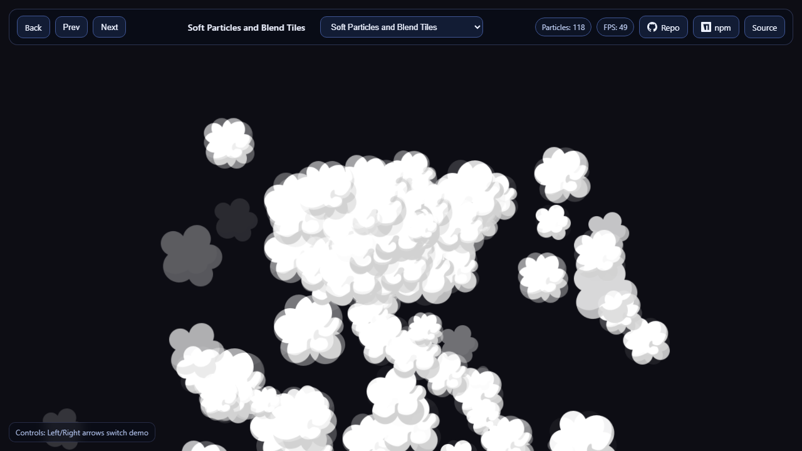](https://soullnik.github.io/babylon.quarks-standalone/babylonDemo.html#SoftParticleDemo)<br>[Soft Particles](https://soullnik.github.io/babylon.quarks-standalone/babylonDemo.html#SoftParticleDemo) |
| [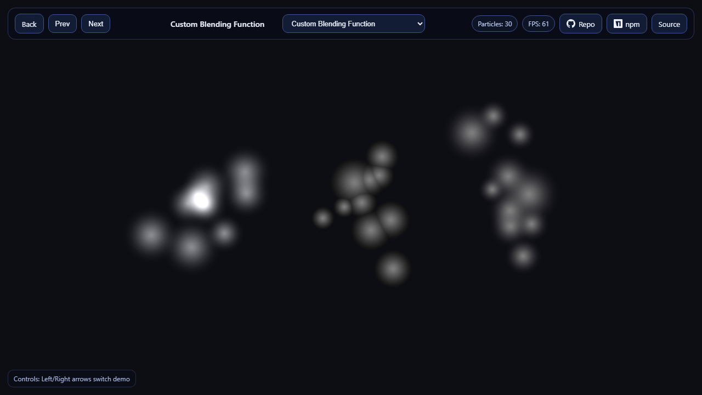](https://soullnik.github.io/babylon.quarks-standalone/babylonDemo.html#CustomBlendingDemo)<br>[Custom Blending](https://soullnik.github.io/babylon.quarks-standalone/babylonDemo.html#CustomBlendingDemo) | [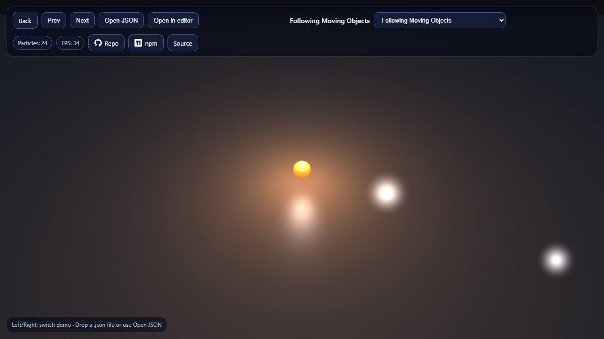](https://soullnik.github.io/babylon.quarks-standalone/babylonDemo.html#FollowObjectDemo)<br>[Follow Moving Objects](https://soullnik.github.io/babylon.quarks-standalone/babylonDemo.html#FollowObjectDemo) | [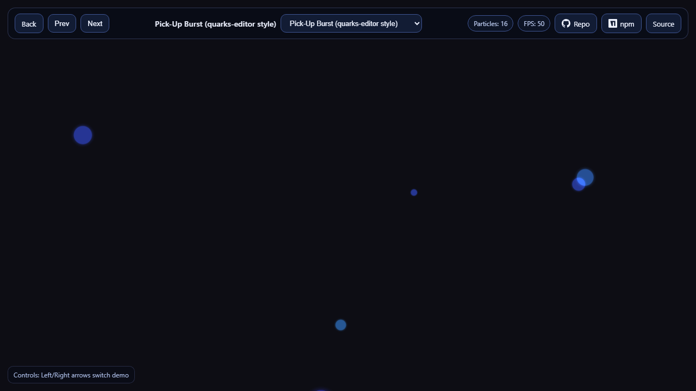](https://soullnik.github.io/babylon.quarks-standalone/babylonDemo.html#PickUpDemo)<br>[Pick-Up Burst](https://soullnik.github.io/babylon.quarks-standalone/babylonDemo.html#PickUpDemo) | [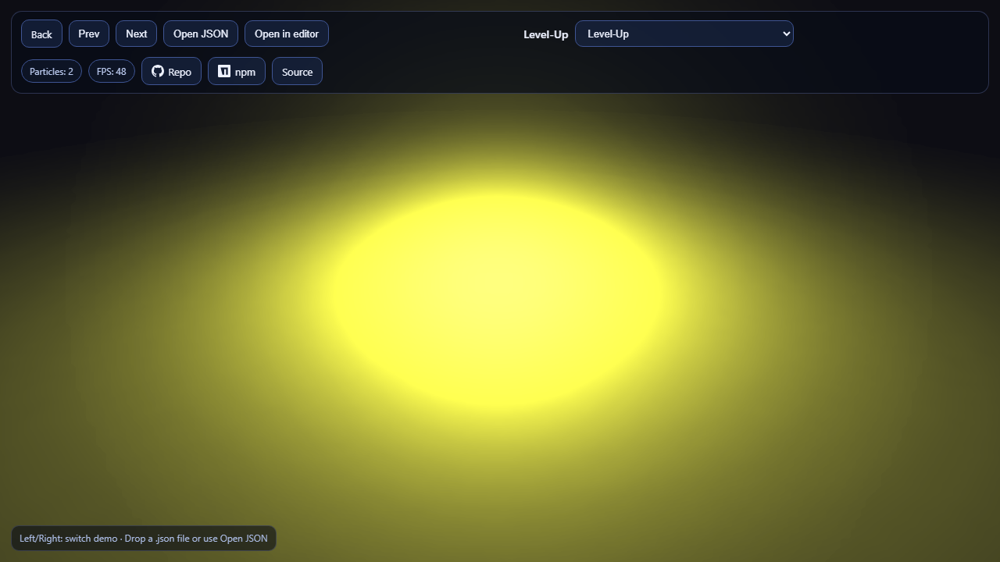](https://soullnik.github.io/babylon.quarks-standalone/babylonDemo.html#LevelUpDemo)<br>[Level-Up](https://soullnik.github.io/babylon.quarks-standalone/babylonDemo.html#LevelUpDemo) |
| [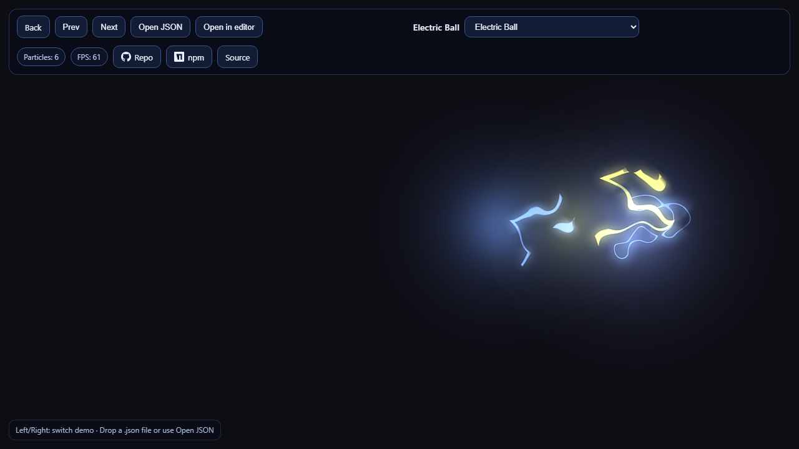](https://soullnik.github.io/babylon.quarks-standalone/babylonDemo.html#ElectricBallDemo)<br>[Electric Ball](https://soullnik.github.io/babylon.quarks-standalone/babylonDemo.html#ElectricBallDemo) | [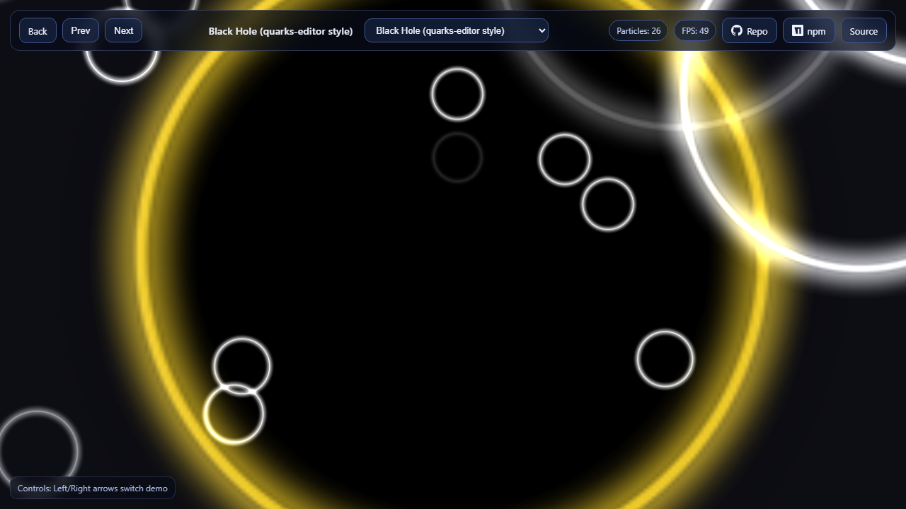](https://soullnik.github.io/babylon.quarks-standalone/babylonDemo.html#BlackHoleDemo)<br>[Black Hole](https://soullnik.github.io/babylon.quarks-standalone/babylonDemo.html#BlackHoleDemo) | | |

## Roadmap

See [ROADMAP.md](ROADMAP.md) for planned improvements (WebGPU, GPU simulation, benchmarks, Playground build) and promotion plans.

## Workspace structure

- `packages/babylon.quarks` - publishable package
- `packages/babylon.quarks-editor` - in-house Shuriken-style effect editor (headless core + React UI)
- `packages/quarks.core` - underlying particle simulation engine
- `tools/unity-quarks-exporter` - Unity Editor tool that exports Shuriken effects to Quarks JSON
- `examples` - Vite app used for local demos, the effect editor page and GitHub Pages

## Quick start

```bash
npm install
npm run build
npm run examples
```

Open local examples at `http://localhost:8001` (Vite picks the next free port if `8000` is busy).

## Quality checks

```bash
npm run test
npm run build:examples
npm run check:pack
npm run check
```

## Refresh demo previews

Run the local examples server first, then generate screenshots:

```bash
npm run dev
npm run capture:previews
```

## Customize Texture Sequencer demo

`Texture Sequencer` reads two images:

- text shape: `examples/public/textures/text_texture.png`
- logo shape: `examples/public/textures/logo_texture.png`

Replace these files with your own PNG images to customize the demo output.

## Contributing

See [CONTRIBUTING.md](CONTRIBUTING.md) for the dev setup, quality checks, demo guide and PR conventions. Package changes are tracked in the [changelog](packages/babylon.quarks/CHANGELOG.md).

## Release checklist

1. Run `npm run check` from repository root.
2. Update `packages/babylon.quarks/CHANGELOG.md` and bump the version in `packages/babylon.quarks/package.json`.
3. Verify tarball content with `npm pack --dry-run --workspace=babylon.quarks`.
4. Publish a GitHub release — CI publishes to npm via trusted publishing (or run the `Publish npm package` workflow manually).
